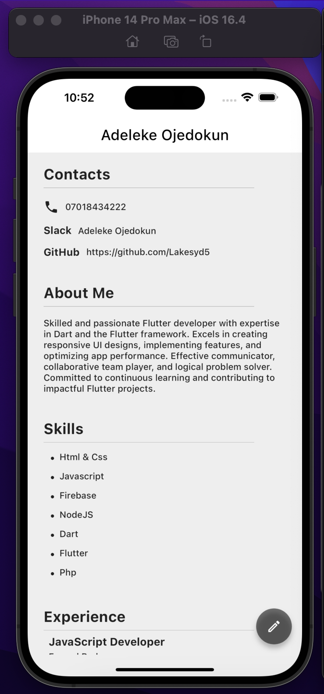
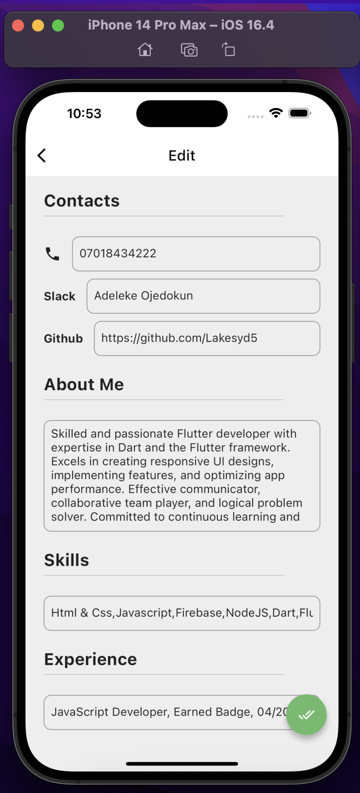

# HngX Task Two

This is a flutter application serving as a comprehensive CV, showcasing personal and professional details. The app allow both viewing and editing of the provided CV information.

## Getting Started
1. Make sure you have Flutter and Dart installed on your system.
2. Clone the repository and run the following commands:
    - flutter clean
    - flutter pub get
    - flutter run
3. For virtual testing of the app
    - Appetize link: https://appetize.io/app/me2n3rznt6mbzlij3nmhlptuf4    

# Screenshots

<h3>Home page</h3>

  

<h3>Edit page</h3>

  

